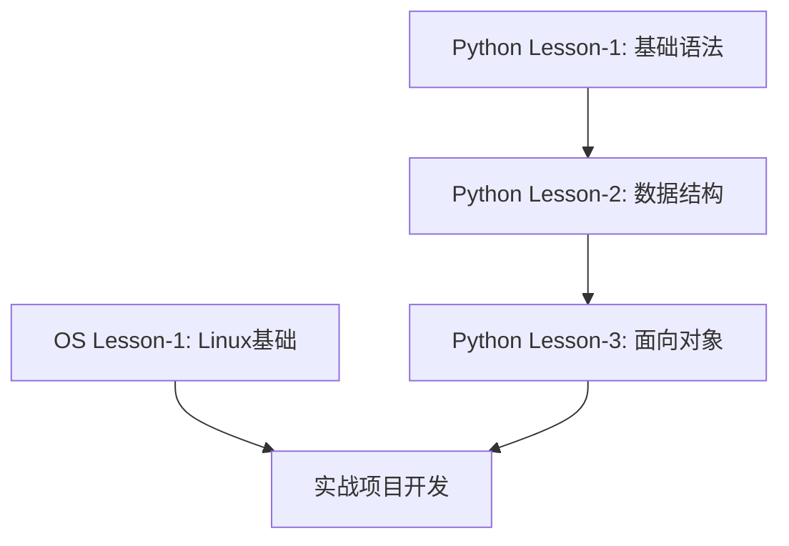

# RoboMaster 2025-2026 年度算法/电控基础课程

## 课程概述

本课程体系专为 RoboMaster 战队成员设计，旨在建立扎实的编程基础和系统运维能力。课程分为两个主要模块：**Python 编程基础**和**Linux 系统基础**，总计 4 节课程。

## 课程目标

- 掌握 Python 编程语言的基础语法和核心概念
- 理解面向对象编程思想和程序设计原则
- 熟悉 Linux 操作系统的基本操作和命令行工具
- 具备基本的系统管理和开发环境配置能力

## 课程结构

### Python 编程模块（3 节课）

- **Lesson-1**: Python 基础语法和数据类型
- **Lesson-2**: 数据结构和控制流程
- **Lesson-3**: 面向对象编程和程序设计

### OS 基础模块（1 节课）

- **Lesson-1**: Linux 系统基础和命令行操作

## 学习路径

## 前置要求

- 具备基本的计算机操作能力
- 对编程有初步兴趣和学习意愿
- 准备一台支持虚拟机的计算机（用于 Linux 学习）

## 课程特色

1. **实战导向**: 每个概念都配有实际编程练习
2. **循序渐进**: 从基础语法到高级概念，逐步深入
3. **项目驱动**: 结合 RoboMaster 实际应用场景
4. **动手实践**: 强调代码编写和系统操作实践

## 评估方式

- 每节课后的编程练习（40%）
- 课程项目作业（40%）
- 课堂参与和提问（20%）

## 学习资源

- 课程代码仓库：本仓库
- 推荐教材：《Python 编程：从入门到实践》
- 在线资源：Python 官方文档、Linux 命令手册
- 开发环境：VS Code + Python 3.8+ + Ubuntu 20.04+

---

**开始学习之前，请确保阅读各模块的 README 文档，了解具体的学习内容和要求。**
