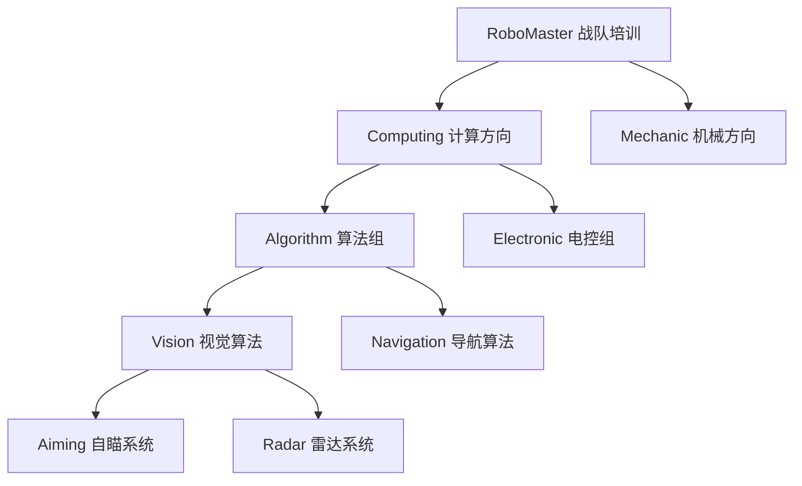

# RoboMaster 战队新成员培训课程 (2025-2026 年度版)

## 课程概述

本培训体系专为 RoboMaster 战队新成员设计，涵盖**算法/电控**和**机械**两大专业方向，旨在培养具备完整机器人开发能力的工程师。无论你选择哪个方向，都将获得扎实的理论基础和丰富的实践经验。

## 📖 项目结构说明

本项目采用**双重组织架构**，同时满足课程内容管理和学习路线指导的需求：

### 📁 Contents/ - 课程内容库

存放所有教学资源和具体课程内容：

- `Python/` - Python 编程基础课程（3 节课）
- `Cpp/` - Cpp 编程基础课程
- `Linux/` - Linux 系统基础课程
- `OpenCV/` - 计算机视觉课程
- `ROS2/` - 机器人操作系统课程
- `Mechanic/` - 机械设计课程

### 🛤️ Routes/ - 学习路线指南

按战队组别组织的个性化学习路径：

- `Computing/` - 算法和电控方向学习路线
- `Computing/Algorithm` - 算法学习路线
- `Computing/Electronic` - 电控（嵌入式）学习路线
- `Mechanic/` - 机械方向学习路线

其中 Computing 目录下的 `README.md` 文件会指导算法/电控方向的同学需要共同学习的内容，依此类推

### 📊 学习路线分支图

### 🔄 使用流程

1. **确定专业方向** → 进入对应的 `Routes/` 目录查看学习路线
2. **按路线学习** → 根据路线指导，进入 `Contents/` 目录学习具体课程
3. **专业深化** → 在基础课程完成后，进入专业方向的高级内容

## 🚀 专业方向选择

### 📊 算法/电控方向

适合对编程、算法、电路设计感兴趣的同学

**核心技能**：Linux 系统管理、Python 编程、Cpp 编程、计算机视觉、嵌入式开发
**就业方向**：软件工程师、算法工程师、嵌入式工程师、系统架构师

[👉 查看算法/电控学习路线](./Routes/Computing/README.md)

### ⚙️ 机械方向

适合对机械设计、结构分析、制造工艺感兴趣的同学

**核心技能**：3D 建模、力学分析、机械结构设计、制造工艺
**就业方向**：机械设计工程师、结构工程师、制造工程师、产品经理

[👉 查看机械学习路线](./Routes/Mechanic/README.md)

## 📚 课程模块概览

### 基础课程模块（所有方向共同学习）

- **Python 编程**：编程基础语法、数据结构、面向对象编程
- **Cpp 编程**：Python 知识迁移
- **Linux 基础**：Linux 系统操作、命令行工具、开发环境配置
- **ROS2 系统**：机器人操作系统基础

### 专业方向模块

**_算法/电控方向_**

- **OpenCV 视觉**：计算机视觉基础、图像处理
- **算法深化**：导航算法、视觉算法（自瞄、雷达）

**_机械方向_**

- **机械设计**：3D 建模、力学分析、结构设计

## 🎯 培养目标

### 算法/电控方向毕业生能力

- 熟练使用 Linux 进行开发工作
- 编写 Python & Cpp 程序解决实际问题
- 使用 OpenCV 进行基础图像处理
- 借助 AI 工具提升开发效率
- 具备 RoboMaster 机器人算法开发能力

### 机械方向毕业生能力

- 熟练使用 Inventor 进行 3D 建模设计
- 理解机械设计中的力学原理
- 掌握机器人常用机械结构设计
- 具备独立设计机器人机械系统的能力
- 掌握有限元分析和结构优化方法

## 🏆 最终考核项目

### 算法/电控方向

基于 OpenCV 的机器人视觉系统，包含：

- 目标识别和追踪
- 图像处理算法优化
- 系统集成和性能调优

### 机械方向

独立设计简易机器人，包含：

- 舵轮移动系统（含被动轮）
- 六自由度机械臂
- 完整的工程图和设计说明书

## 🛠️ 学习环境

### 软件工具

**算法/电控**：Git、VS Code、虚拟机（Ubuntu 22.04）、Python、Cpp、OpenCV、ROS2 Humble、Linux 工具链
**机械**：Autodesk Inventor

### 硬件要求

- 系统：电控/算法 Windows 或 macOS 皆可，机械组需要 Windows
- 内存：8GB+ （推荐 16GB+）
- 硬盘：50GB+可用空间
- 处理器：电控/算法 如是 Windows 需要支持虚拟化的 64 位 CPU
- 网络：稳定的互联网连接，如果不在学校网络环境下需要代理

## 📖 学习资源

### 在线资源

- [CS 自学指南](https://csdiy.wiki/) - 计算机科学学习路径
- [RoboMaster 官方技术论坛](https://www.robomaster.com/) - 比赛技术交流
- [Autodesk 教育版](https://www.autodesk.com/education/) - 免费软件下载

## 🚀 本地环境配置指南 / 快速开始

- 请移步 [ENV_SETUP.md](./ENV_SETUP.md)

## 维护人员名单

- [Robert He](https://github.com/hnrobert)
- [Xiaoyan Gong](https://github.com/Calc1te)
- [Animex77](https://github.com/Animex77)
- [lv_xin](https://github.com/lvxin1024)
- [HappyDog](https://github.com/HappyDog060713)

祝你食用愉快！
