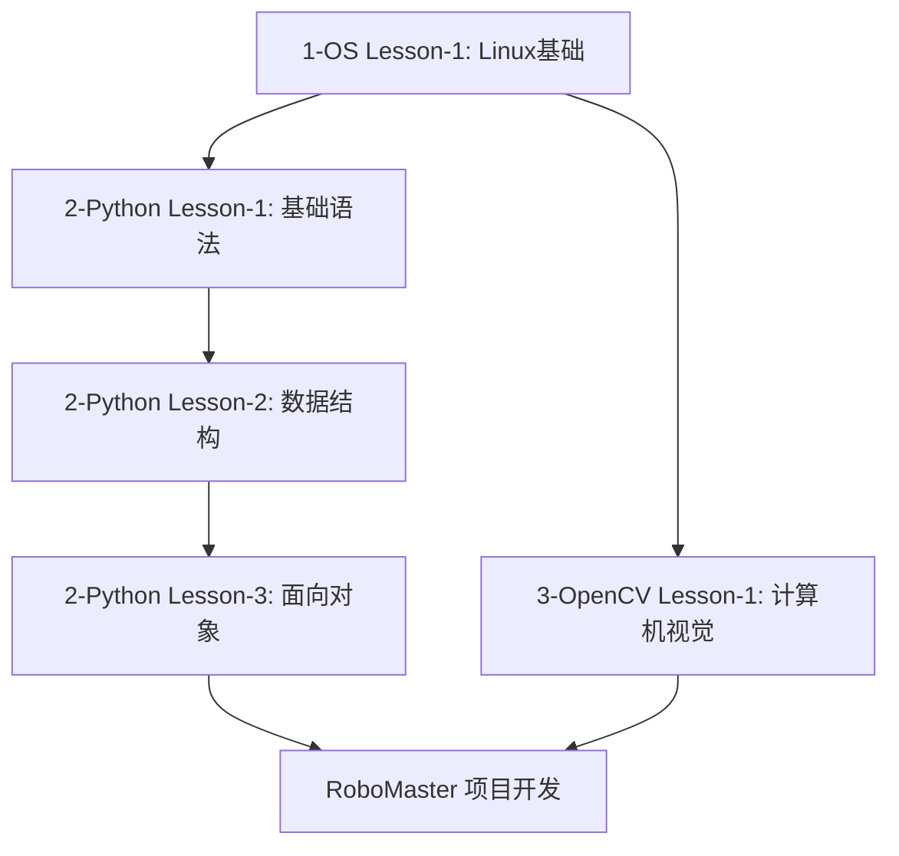

# RoboMaster 2025-2026 年度算法/电控基础课程

## 课程概述

本课程体系专为 RoboMaster 战队成员设计，旨在建立从系统基础到计算机视觉应用的完整技能体系。课程分为三个主要模块：**Linux 系统基础**、**Python 编程基础**和**OpenCV 计算机视觉**，总计 5 节课程。

## 课程目标

- 掌握 Linux 操作系统的基本操作和 SSH 远程管理
- 掌握 Python 编程语言的基础语法和核心概念
- 理解面向对象编程思想和程序设计原则
- 掌握 OpenCV 环境部署和基础图像处理
- 学会使用 AI 工具辅助开发和调试
- 具备 RoboMaster 机器人开发的基础技能

## 课程结构

### 1-OS 基础模块（1 节课）

- **Lesson-1**: Linux 系统基础和命令行操作
  - Linux 系统概述和 Ubuntu 安装配置
  - 命令行基础操作和文件管理
  - SSH 远程连接和密钥认证
  - 软件包管理和开发环境配置

### 2-Python 编程模块（3 节课）

- **Lesson-1**: Python 基础语法和数据类型

  - Python 环境配置和基础语法
  - 数据类型和运算符
  - 输入输出和简单程序设计

- **Lesson-2**: 数据结构和控制流程

  - 列表、字典、元组、集合
  - 条件语句和循环结构
  - 函数定义和模块化编程

- **Lesson-3**: 面向对象编程和程序设计
  - 类和对象的概念
  - 继承、封装、多态
  - 异常处理和文件操作

### 3-OpenCV 计算机视觉模块（1 节课）

- **Lesson-1**: OpenCV 环境部署和人脸识别实战
  - SSH 远程开发环境搭建
  - Git 版本控制和 CMake 项目构建
  - OpenCV 安装和配置
  - AI 辅助生成 C++ 人脸识别代码

## 学习路径



## 课程特色

### 🎯 **实践导向**

- 每个模块都包含完整的实战项目
- 从简单计算器到人脸识别系统
- 注重动手能力和问题解决

### 🤖 **RoboMaster 专用**

- 针对机器人开发需求设计
- 涵盖系统管理、编程、视觉处理
- 为后续比赛开发打下基础

### 🧠 **AI 辅助学习**

- 教授如何使用 AI 工具辅助编程
- 学会代码生成和调试技巧
- 培养现代开发者必备技能

### 📈 **循序渐进**

- 从基础系统操作到高级编程概念
- 合理的难度梯度设计
- 充分的练习和作业安排

## 前置要求

- 具备基本的计算机操作能力
- 对编程和机器人技术有学习兴趣
- 准备一台支持虚拟机的计算机（内存 8GB+，硬盘 50GB+）
- 稳定的网络连接（用于软件下载和 AI 工具使用）

## 技能成果

完成本课程后，学员将能够：

- 熟练使用 Linux 系统进行开发工作
- 编写 Python 程序解决实际问题
- 使用 OpenCV 进行基础图像处理
- 通过 SSH 远程管理开发环境
- 使用 Git 进行版本控制
- 借助 AI 工具提升开发效率
- 具备 RoboMaster 机器人开发的基础能力

## 学习资源

- **课程代码仓库**: 本仓库
- **在线资源**: [CS 自学指南](https://csdiy.wiki/)
- **开发环境**: VS Code + Python 3.8+ + Ubuntu 22.04
- **AI 工具**: GitHub Copilot, ChatGPT, Claude 等
- **官方文档**: Python、OpenCV、Ubuntu 官方文档

## 评估方式

- **课堂练习**（30%）：每节课的实际操作练习
- **课后作业**（40%）：综合性项目作业
- **最终项目**（30%）：结合所学知识的综合项目

## 快速开始

1. **环境准备**

   ```bash
   # 克隆课程仓库
   git clone https://github.com/UNNC-AIM/2026-AIM-Courses.git
   cd 2026-AIM-Courses
   ```

2. **学习路径建议**

   - 首先完成 `1-OS-Basic` 模块，搭建 Linux 开发环境
   - 然后按顺序学习 `2-Python` 三个课程
   - 最后学习 `3-OpenCV` 计算机视觉应用

3. **获得帮助**
   - 查看各模块的 README 文档获得详细指导
   - 在课程群组中提问交流
   - 利用 AI 工具辅助学习和调试
