# Navigation 导航算法学习路线

## 🧭 适用对象

**算法组**中专注**导航算法**的成员学习路线

## 学习路径

```mermaid
graph TD
    A[🧭 Navigation 导航算法] --> B[🔰 基础准备]
    A --> C[🗺️ 导航理论基础]
    A --> D[🎯 核心算法模块]
    A --> E[🤖 RoboMaster专项]
    A --> F[🎓 进阶技术]

    B --> B1[📄 Python 编程<br/>→ Contents/Python/]
    B --> B2[� OS 基础<br/>→ Contents/OS-Basic/]
    B --> B3[🤖 ROS2 系统<br/>→ Contents/ROS2/]

    C --> C1[📐 坐标系统与变换]
    C --> C2[📊 概率论基础]
    C --> C3[📈 图论基础]

    C1 --> C11[坐标系定义]
    C1 --> C12[旋转矩阵与四元数]
    C1 --> C13[齐次变换矩阵]

    C2 --> C21[贝叶斯定理]
    C2 --> C22[高斯分布]
    C2 --> C23[随机过程]

    C3 --> C31[图的表示方法]
    C3 --> C32[搜索算法]
    C3 --> C33[最短路径算法]

    D --> D1[📍 定位与建图SLAM]
    D --> D2[🛤️ 路径规划]
    D --> D3[🎮 运动控制]

    D1 --> D11[传感器融合]
    D1 --> D12[滤波算法]
    D1 --> D13[地图构建]
    D1 --> D14[回环检测]

    D11 --> D111[IMU数据处理]
    D11 --> D112[激光雷达SLAM]
    D11 --> D113[视觉SLAM]

    D12 --> D121[扩展卡尔曼滤波]
    D12 --> D122[无迹卡尔曼滤波]
    D12 --> D123[粒子滤波]

    D2 --> D21[全局路径规划]
    D2 --> D22[局部路径规划]
    D2 --> D23[路径优化]

    D21 --> D211[A*算法]
    D21 --> D212[RRT算法族]
    D21 --> D213[Dijkstra算法]

    D22 --> D221[DWA动态窗口法]
    D22 --> D222[TEB时间弹性带]
    D22 --> D223[MPC模型预测控制]

    D3 --> D31[运动学建模]
    D3 --> D32[控制算法]
    D3 --> D33[路径跟踪]

    D31 --> D311[差分驱动模型]
    D31 --> D312[阿克曼转向模型]
    D31 --> D313[麦克纳姆轮模型]

    D32 --> D321[PID控制]
    D32 --> D322[LQR控制]
    D32 --> D323[滑模控制]

    E --> E1[⚔️ 战场导航]
    E --> E2[🧠 自主决策]
    E --> E3[⚡ 性能优化]

    E1 --> E11[实时避障]
    E1 --> E12[多机协作导航]
    E1 --> E13[战术路径规划]

    E2 --> E21[任务规划]
    E2 --> E22[行为树]
    E2 --> E23[状态机设计]

    F --> F1[🧠 深度学习导航]
    F --> F2[👥 群体智能]
    F --> F3[🔄 自适应导航]

    F1 --> F11[深度强化学习]
    F1 --> F12[端到端导航]
    F1 --> F13[视觉导航网络]

    F2 --> F21[多机器人编队]
    F2 --> F22[分布式SLAM]
    F2 --> F23[集群导航]

    style A fill:#e1f5fe
    style B fill:#f3e5f5
    style C fill:#e8f5e8
    style D fill:#fff3e0
    style E fill:#ffebee
    style F fill:#fce4ec
```

## 📚 学习顺序建议

### 前置要求

完成 Computing 基础课程：Python + OS + ROS2

### 第一阶段：理论基础 (3-4 周)

- **数学基础** - 坐标变换、概率论、图论
- **ROS2 导航框架** - Navigation2 导航栈

### 第二阶段：核心算法 (6-8 周)

- **SLAM 定位建图** (2-3 周) - 传感器融合、滤波算法
- **路径规划** (2-3 周) - 全局规划、局部规划
- **运动控制** (2 周) - 控制理论、路径跟踪

### 第三阶段：项目实战 (3-4 周)

- **RoboMaster 导航系统** - 战场自主导航
- **多机协作** - 编队控制、协同 SLAM

## 🎯 培养目标

完成学习路线后，你将具备：

- ✅ 扎实的导航算法理论基础
- ✅ 熟练的 SLAM 系统开发能力
- ✅ 完整的路径规划算法实现能力
- ✅ 运动控制系统设计能力
- ✅ RoboMaster 比赛级导航系统开发经验

## 🏆 专业考核项目

开发完整的自主导航系统，包含：

- **实时 SLAM 定位建图**
- **动态环境路径规划**
- **精确运动控制**
- **多机协作导航**
