# Aiming 自瞄系统学习路线

## 🎯 适用对象

**Vision 视觉算法组**中专注**自瞄系统**开发的成员学习路线

## 学习路径

```mermaid
graph TD
    A[🎯 Aiming 自瞄系统] --> B[🔰 基础准备]
    A --> C[🔍 目标检测模块]
    A --> D[📡 目标追踪模块]
    A --> E[🧮 弹道预测模块]
    A --> F[🎮 控制系统模块]
    A --> G[🎓 系统集成与优化]

    B --> B1[� Python 编程<br/>→ Contents/Python/]
    B --> B2[� OpenCV 基础<br/>→ Contents/OpenCV/]
    B --> B3[🤖 ROS2 系统<br/>→ Contents/ROS2/]

    C --> C1[🔧 传统CV方法]
    C --> C2[🧠 深度学习方法]

    C1 --> C11[颜色空间转换]
    C1 --> C12[轮廓检测]
    C1 --> C13[装甲板识别]
    C1 --> C14[数字识别]

    C11 --> C111[HSV颜色过滤]
    C11 --> C112[阈值分割]
    C11 --> C113[形态学操作]

    C12 --> C121[边缘检测算法]
    C12 --> C122[轮廓提取与筛选]
    C12 --> C123[轮廓特征分析]

    C2 --> C21[目标检测网络]
    C2 --> C22[数据集制作]
    C2 --> C23[模型训练]
    C2 --> C24[模型部署]

    C21 --> C211[YOLO系列]
    C21 --> C212[SSD检测器]
    C21 --> C213[Faster R-CNN]

    D --> D1[🎯 单目标追踪]
    D --> D2[� 多目标追踪]

    D1 --> D11[卡尔曼滤波]
    D1 --> D12[相关滤波]
    D1 --> D13[深度学习追踪]

    D11 --> D111[状态预测]
    D11 --> D112[观测更新]
    D11 --> D113[噪声建模]

    D2 --> D21[数据关联]
    D2 --> D22[目标管理]
    D2 --> D23[深度学习MOT]

    E --> E1[⚗️ 物理建模]
    E --> E2[📊 运动预测]
    E --> E3[🎯 射击决策]

    E1 --> E11[抛物运动方程]
    E1 --> E12[弹丸参数]
    E1 --> E13[环境参数]

    E2 --> E21[目标运动建模]
    E2 --> E22[预测算法]
    E2 --> E23[不确定性处理]

    E3 --> E31[命中概率计算]
    E3 --> E32[射击时机选择]
    E3 --> E33[多目标决策]

    F --> F1[🎮 云台控制]
    F --> F2[⚖️ 稳定性优化]

    F1 --> F11[运动学建模]
    F1 --> F12[PID控制器]
    F1 --> F13[高级控制]

    F11 --> F111[pitch轴控制]
    F11 --> F112[yaw轴控制]
    F11 --> F113[耦合分析]

    F2 --> F21[振动抑制]
    F2 --> F22[精度提升]
    F2 --> F23[动态性能]

    G --> G1[⚡ 实时性优化]
    G --> G2[🛡️ 鲁棒性增强]
    G --> G3[📊 性能评估]

    G1 --> G11[算法加速]
    G1 --> G12[多线程并行]
    G1 --> G13[内存优化]

    G2 --> G21[异常处理]
    G2 --> G22[故障恢复]
    G2 --> G23[环境适应]

    G3 --> G31[精度测试]
    G3 --> G32[延迟分析]
    G3 --> G33[稳定性验证]

    style A fill:#e1f5fe
    style B fill:#f3e5f5
    style C fill:#e8f5e8
    style D fill:#fff3e0
    style E fill:#ffebee
    style F fill:#f1f8e9
    style G fill:#fce4ec
```

## 📚 学习顺序建议

### 前置要求

完成 Vision 视觉基础：Python + OpenCV + ROS2

### 第一阶段：目标检测 (3-4 周)

- **传统 CV 方法** (2 周) - 颜色过滤、轮廓检测、装甲板识别
- **深度学习方法** (2 周) - YOLO 训练、模型部署

### 第二阶段：追踪与预测 (3-4 周)

- **目标追踪** (2 周) - 卡尔曼滤波、多目标追踪
- **弹道预测** (2 周) - 物理建模、运动预测

### 第三阶段：控制与集成 (2-3 周)

- **云台控制** (1-2 周) - PID 控制、稳定性优化
- **系统集成** (1 周) - 实时性优化、性能调试

## 🎯 培养目标

完成学习路线后，你将具备：

- ✅ 完整的装甲板检测算法开发能力
- ✅ 多目标追踪系统设计能力
- ✅ 弹道预测与射击决策算法实现能力
- ✅ 云台控制系统开发能力
- ✅ 实时自瞄系统集成与优化能力

## 🏆 专业考核项目

开发完整的自动瞄准系统，包含：

- **实时装甲板检测与识别**
- **多目标追踪与管理**
- **精确弹道预测**
- **云台自动控制**
- **射击决策系统**

## 📊 性能指标

- **检测精度**: >95%
- **追踪稳定性**: >90%
- **预测准确度**: 偏差<5cm
- **系统延迟**: <50ms
- **命中率**: >80%
