# Vision 视觉算法学习路线

## 👁️ 适用对象

**算法组**中专注**视觉算法**的成员学习路线

## 学习资料

OpenCV 基础：[点击查看](../../../../Contents/OpenCV/README.md)

## 学习路径

```mermaid
graph TD
    A[👁️ Vision 视觉算法] --> B[🔰 基础准备]
    A --> C[👁️ 计算机视觉基础]
    A --> D[🎯 专业分化]
    A --> E[🎓 进阶技术]

    B --> B1[🐍 Python 编程<br/>→ Contents/Python/]
    B --> B2[🐧 Linux 基础<br/>→ Contents/Linux/]
    B --> B3[🤖 ROS2 系统<br/>→ Contents/ROS2/]

    C --> C1[� OpenCV 基础<br/>→ Contents/OpenCV/]

    C1 --> C11[OpenCV环境部署]
    C1 --> C12[图像处理基础]
    C1 --> C13[特征检测与匹配]
    C1 --> C14[目标识别算法]
    C1 --> C15[人脸识别实战]

    D --> D1[🎯 Aiming 自瞄系统]
    D --> D2[📡 Radar 雷达系统]

    D1 --> D11[🔍 目标检测算法]
    D1 --> D12[📍 目标追踪算法]
    D1 --> D13[🎯 弹道预测]
    D1 --> D14[🎮 视觉伺服控制]

    D11 --> D111[传统CV方法]
    D11 --> D112[深度学习方法]
    D11 --> D113[实时检测优化]

    D12 --> D121[卡尔曼滤波]
    D12 --> D122[粒子滤波]
    D12 --> D123[多目标追踪]

    D13 --> D131[物理建模]
    D13 --> D132[运动预测]
    D13 --> D133[射击决策]

    D14 --> D141[云台控制]
    D14 --> D142[PID调节]
    D14 --> D143[稳定性优化]

    D2 --> D21[� 装甲板识别]
    D2 --> D22[🗺️ 场地感知]
    D2 --> D23[👥 敌方位置检测]
    D2 --> D24[🗺️ 战术地图构建]

    D21 --> D211[数字识别算法]
    D21 --> D212[装甲板分类]
    D21 --> D213[距离估算]

    D22 --> D221[全景拼接]
    D22 --> D222[鸟瞰图生成]
    D22 --> D223[实时更新]

    D23 --> D231[运动目标检测]
    D23 --> D232[多机器人识别]
    D23 --> D233[威胁评估]

    D24 --> D241[地图融合]
    D24 --> D242[信息共享]
    D24 --> D243[策略决策支持]

    E --> E1[🧠 深度学习应用]
    E --> E2[🔗 多传感器融合]
    E --> E3[⚡ 实时系统优化]

    E1 --> E11[神经网络基础]
    E1 --> E12[CNN卷积网络]
    E1 --> E13[目标检测网络]

    E2 --> E21[相机标定]
    E2 --> E22[激光雷达融合]
    E2 --> E23[IMU数据融合]

    E3 --> E31[算法加速]
    E3 --> E32[内存优化]
    E3 --> E33[并行处理]

    style A fill:#e1f5fe
    style B fill:#f3e5f5
    style C fill:#e8f5e8
    style D fill:#fff3e0
    style E fill:#fce4ec
    style D1 fill:#ffebee
    style D2 fill:#f1f8e9
```

## 📚 学习顺序建议

### 前置要求

完成 Computing 基础课程：Python + Linux + Cpp + ROS2

### 第一阶段：视觉基础 (2-3 周)

- **OpenCV 基础** - 图像处理、特征检测、目标识别

### 第二阶段：专业方向选择 (4-6 周)

选择以下方向之一深入学习：

**_🎯 自瞄系统方向_**

- 目标检测与追踪算法开发
- 弹道预测与视觉伺服控制

**_📡 雷达系统方向_**

- 全景感知与地图构建
- 多目标识别与威胁评估

### 第三阶段：项目实战 (2-4 周)

- 实际 RoboMaster 机器人视觉系统开发
- 算法优化与性能调试

## 🎯 培养目标

完成学习路线后，你将具备：

- ✅ 扎实的计算机视觉理论基础
- ✅ 熟练的 OpenCV 开发能力
- ✅ 专业方向的算法开发技能
- ✅ RoboMaster 比赛级视觉系统开发经验
- ✅ 实时系统优化能力

## 🏆 专业考核项目

### 自瞄系统方向

开发完整的自动瞄准系统，包含：

- 实时目标检测与识别
- 目标追踪与预测
- 云台控制与射击决策

### 雷达系统方向

开发战术雷达系统，包含：

- 全景敌方检测
- 实时战术地图
- 多机协作信息共享
