# Radar 雷达系统学习路线

## 📡 适用对象

**Vision 视觉算法组**中专注**雷达系统**开发的成员学习路线

## 学习路径

```mermaid
graph TD
    A[📡 Radar 雷达系统] --> B[🔰 基础准备]
    A --> C[🎯 装甲板识别模块]
    A --> D[🗺️ 场地感知模块]
    A --> E[🎯 敌方检测模块]
    A --> F[�️ 战术地图构建]
    A --> G[🎓 系统集成与应用]

    B --> B1[📄 Python 编程<br/>→ Contents/Python/]
    B --> B2[� OpenCV 基础<br/>→ Contents/OpenCV/]
    B --> B3[🤖 ROS2 系统<br/>→ Contents/ROS2/]

    C --> C1[🔍 装甲板检测]
    C --> C2[🔢 数字识别]
    C --> C3[📊 装甲板分类]

    C1 --> C11[多角度检测]
    C1 --> C12[尺度变化适应]
    C1 --> C13[光照适应]

    C11 --> C111[仿射变换]
    C11 --> C112[透视变换]
    C11 --> C113[角度估算]

    C2 --> C21[字符分割]
    C2 --> C22[特征提取]
    C2 --> C23[分类算法]
    C2 --> C24[识别优化]

    C3 --> C31[机器人类型识别]
    C3 --> C32[威胁等级评估]
    C3 --> C33[优先级排序]

    D --> D1[�️ 全景拼接]
    D --> D2[🗺️ 鸟瞰图生成]
    D --> D3[🌍 环境建模]

    D1 --> D11[特征点检测]
    D1 --> D12[特征匹配]
    D1 --> D13[图像配准]
    D1 --> D14[图像融合]

    D2 --> D21[相机标定]
    D2 --> D22[透视变换]
    D2 --> D23[图像融合]
    D2 --> D24[坐标系统]

    D3 --> D31[静态环境]
    D3 --> D32[动态环境]
    D3 --> D33[环境状态]

    E --> E1[🎯 运动目标检测]
    E --> E2[🤖 多机器人识别]
    E --> E3[⚠️ 威胁评估]

    E1 --> E11[背景建模]
    E1 --> E12[运动分析]
    E1 --> E13[目标分割]
    E1 --> E14[目标验证]

    E2 --> E21[外观特征]
    E2 --> E22[运动特征]
    E2 --> E23[身份识别]
    E2 --> E24[状态估计]

    E3 --> E31[距离分析]
    E3 --> E32[方向分析]
    E3 --> E33[能力分析]
    E3 --> E34[综合评分]

    F --> F1[� 信息融合]
    F --> F2[🔄 地图更新]
    F --> F3[📡 信息共享]

    F1 --> F11[多源数据融合]
    F1 --> F12[时空对齐]
    F1 --> F13[不确定性处理]
    F1 --> F14[数据质量控制]

    F2 --> F21[实时更新机制]
    F2 --> F22[历史信息管理]
    F2 --> F23[预测功能]
    F2 --> F24[地图优化]

    F3 --> F31[通信协议]
    F3 --> F32[数据压缩]
    F3 --> F33[网络管理]
    F3 --> F34[安全机制]

    G --> G1[⚡ 性能优化]
    G --> G2[🛡️ 鲁棒性设计]
    G --> G3[⚔️ 战术应用]

    G1 --> G11[算法优化]
    G1 --> G12[并行计算]
    G1 --> G13[硬件加速]

    G2 --> G21[异常处理]
    G2 --> G22[故障恢复]
    G2 --> G23[降级运行]

    G3 --> G31[态势感知]
    G3 --> G32[决策支持]
    G3 --> G33[协同作战]

    style A fill:#e1f5fe
    style B fill:#f3e5f5
    style C fill:#e8f5e8
    style D fill:#fff3e0
    style E fill:#ffebee
    style F fill:#f1f8e9
    style G fill:#fce4ec
```

## 📚 学习顺序建议

### 前置要求

完成 Vision 视觉基础：Python + OpenCV + ROS2

### 第一阶段：基础检测 (3-4 周)

- **装甲板识别** (2 周) - 检测、数字识别、分类
- **场地感知** (2 周) - 全景拼接、鸟瞰图生成

### 第二阶段：高级感知 (3-4 周)

- **敌方检测** (2 周) - 运动检测、多目标识别
- **威胁评估** (1 周) - 威胁分析、优先级排序

### 第三阶段：系统集成 (2-3 周)

- **战术地图** (2 周) - 信息融合、实时更新
- **系统优化** (1 周) - 性能调优、鲁棒性测试

## 🎯 培养目标

完成学习路线后，你将具备：

- ✅ 完整的装甲板识别与分类能力
- ✅ 全景场地感知系统开发能力
- ✅ 多目标检测与威胁评估能力
- ✅ 战术地图构建与信息融合能力
- ✅ 多机协作雷达系统集成能力

## 🏆 专业考核项目

开发完整的战术雷达系统，包含：

- **实时装甲板识别与分类**
- **全景场地感知**
- **多机器人检测与追踪**
- **实时战术地图**
- **多机信息共享**

## 📊 性能指标

- **检测范围**: 全场覆盖
- **识别精度**: >90%
- **更新频率**: >10Hz
- **延迟时间**: <100ms
- **覆盖率**: >95%
