 # Electronic 电控组学习路线

## ⚡ 适用对象

**Computing 计算方向**中专注**电控系统**开发的成员学习路线

## 学习路径

```mermaid
graph TD
    A[⚡ Electronic 电控组] --> B[🔰 基础准备]
    A --> C[🔧 硬件基础]
    A --> D[� 嵌入式开发]
    A --> E[🎮 控制系统]
    A --> F[🤖 RoboMaster专项]
    A --> G[🎓 高级应用]

    B --> B1[📄 Python 编程<br/>→ Contents/Python/]
    B --> B2[� Linux 基础<br/>→ Contents/Linux/]
    B --> B3[🤖 ROS2 系统<br/>→ Contents/ROS2/]

    C --> C1[⚡ 电路原理]
    C --> C2[🔌 PCB设计]
    C --> C3[📡 传感器技术]

    C1 --> C11[基础电路理论]
    C1 --> C12[半导体器件]
    C1 --> C13[数字电路]

    C2 --> C21[原理图设计]
    C2 --> C22[PCB布局布线]
    C2 --> C23[制造工艺]

    C3 --> C31[位置传感器]
    C3 --> C32[运动传感器]
    C3 --> C33[视觉传感器]

    D --> D1[🖥️ 微控制器编程]
    D --> D2[⏱️ 实时操作系统]
    D --> D3[� 通信协议]

    D1 --> D11[STM32系列]
    D1 --> D12[ARM Cortex架构]
    D1 --> D13[外设接口]

    D2 --> D21[FreeRTOS]
    D2 --> D22[RT-Thread]
    D2 --> D23[实时性设计]

    D3 --> D31[串行通信]
    D3 --> D32[网络通信]
    D3 --> D33[总线通信]

    E --> E1[🔄 电机控制]
    E --> E2[📊 控制算法]
    E --> E3[🔗 系统集成]

    E1 --> E11[直流电机]
    E1 --> E12[伺服电机]
    E1 --> E13[电机驱动]

    E2 --> E21[PID控制]
    E2 --> E22[现代控制]
    E2 --> E23[自适应控制]

    E3 --> E31[多轴协调]
    E3 --> E32[安全系统]
    E3 --> E33[人机接口]

    F --> F1[🚗 底盘控制]
    F --> F2[🎯 云台控制]
    F --> F3[🔫 发射机构]

    F1 --> F11[轮式底盘]
    F1 --> F12[运动学建模]
    F1 --> F13[动力分配]

    F2 --> F21[二轴云台]
    F2 --> F22[姿态控制]
    F2 --> F23[稳定性优化]

    F3 --> F31[摩擦轮发射]
    F3 --> F32[供弹系统]
    F3 --> F33[射频控制]

    G --> G1[⚡ 功率管理]
    G --> G2[🔧 故障诊断]
    G --> G3[📈 性能优化]

    style A fill:#e1f5fe
    style B fill:#f3e5f5
    style C fill:#e8f5e8
    style D fill:#fff3e0
    style E fill:#ffebee
    style F fill:#f1f8e9
    style G fill:#fce4ec
```

## 📚 学习顺序建议

### 前置要求

完成 Computing 基础课程：Python + Linux + Cpp + ROS2

### 第一阶段：通信协议介绍 
- **soem库使用**  - 主从站配置，数据收发
- **ethercat基本原理**

### 第二阶段：电机控制基础与进阶
- **速度环，位置环控制** - pid参数实践
- **舵轮结构原理** - 转向与驱动电机控制
- **底盘运动学正逆解算**
- **舵轮底盘控制与运动** 

### 第三阶段：硬件连接与架构 
- **基本线路连接** - 裁判系统与电设连接 

### 第四阶段：RoboMaster 专项 
- **遥控器通讯协议解析与使用** (1-2 周) - 可能今年要换控？
- **云台控制** (1 周) - stewart六轴与普通双轴云台控制
- **发射机构** (1 周) - 摩擦轮控制

## 🎯 培养目标
、

完成学习路线后，你将具备：

- ✅ 工业通信协议应用能力
- ✅ 电机与底盘控制核心能力
- ✅ 硬件系统搭建与集成能力
- ✅ 系统调试与问题解决能力
- ✅ 耐心与毅力（

## 🏆 专业考核项目

开发完整的 RoboMaster 电控系统，包含：

- **底盘运动控制**
- **云台姿态控制**
- **发射机构控制**

