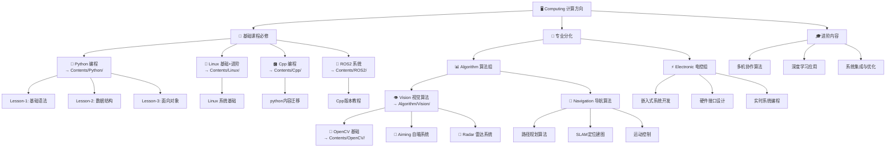

# Computing 计算方向学习路线

## 📊 适用对象

**算法组**和**电控组**成员共同学习路线

## 学习资料

Python 编程：[点击查看](../../Contents/Python/README.md)  
Linux 基础：[点击查看](../../Contents/Linux/README.md)  
Cpp 编程：[点击查看](../../Contents/Cpp/README.md)  
ROS2 系统：[点击查看](../../Contents/ROS2/README.md)

## 学习路径

## 📚 课程安排

### 第一阶段：基础能力建设 (6-7 周)

1. **Python 编程** (国庆 4 天特训) - 编程基础，为后续学习打下基础
2. **Linux 基础** (1 周) - Linux 环境熟悉，开发环境搭建
3. **Cpp 编程** （2 周）- 由 Python 转向 Cpp 编写
4. **ROS2 系统** (2 周) - 机器人框架基础

### 第二阶段：专业方向选择 (2-3 周)

根据兴趣和战队需求选择：

- **算法组** → 深入 Vision 或 Navigation 方向
- **电控组** → 专注嵌入式和硬件开发

### 第三阶段：项目实战 (2-4 周)

- 参与 RoboMaster 机器人项目开发
- 完成最终考核项目

## 🎯 培养目标

完成学习路线后，你将具备：

- ✅ 熟练的 Python 编程能力
- ✅ Linux 开发环境使用能力
- ✅ ROS2 机器人框架应用能力
- ✅ 专业方向的核心技能
- ✅ RoboMaster 比赛开发经验
