# Mechanic 机械方向学习路线

## 🔧 适用对象

**机械组**成员学习路线

## 🌳 学习路径树状图

```mermaid
graph TD
    A[🔧 Mechanic 机械方向] --> B[🔰 基础课程必修]
    A --> C[🎯 专业深化]
    A --> D[🤖 RoboMaster专项]
    A --> E[🎓 进阶应用]

    B --> F[🛠️ 机械设计基础<br/>→ Contents/Mechanic/]

    F --> F1[Inventor 3D建模]
    F --> F2[草图绘制与约束]
    F --> F3[零件建模技术]
    F --> F4[装配设计方法]
    F --> F5[工程图绘制]

    C --> G[📐 基础力学]
    C --> H[🔧 基础结构]

    G --> G1[静力学基础]
    G --> G2[动力学基础]
    G --> G3[材料力学]

    G1 --> G11[力系平衡]
    G1 --> G12[桁架分析]
    G1 --> G13[梁的弯曲]

    G2 --> G21[质点动力学]
    G2 --> G22[刚体运动]
    G2 --> G23[振动分析]

    G3 --> G31[应力应变分析]
    G3 --> G32[强度计算]
    G3 --> G33[疲劳设计]

    H --> H1[轴系设计]
    H --> H2[传动系统]
    H --> H3[材料选择]
    H --> H4[加工工艺]

    H1 --> H11[轴的设计计算]
    H1 --> H12[轴承选择]
    H1 --> H13[联轴器设计]

    H2 --> H21[齿轮传动]
    H2 --> H22[带传动]
    H2 --> H23[链传动]

    H3 --> H31[金属材料]
    H3 --> H32[非金属材料]
    H3 --> H33[复合材料]

    H4 --> H41[机械加工]
    H4 --> H42[3D打印]
    H4 --> H43[表面处理]

    D --> I[🚗 舵轮移动系统]
    D --> J[🦾 机械臂设计]
    D --> K[🔗 整车集成]

    I --> I1[底盘结构设计]
    I --> I2[动力传动设计]
    I --> I3[悬挂系统设计]

    J --> J1[六自由度结构]
    J --> J2[关节设计]
    J --> J3[末端执行器]

    K --> K1[模块化设计]
    K --> K2[装配工艺]
    K --> K3[维护性设计]

    E --> L1[有限元分析FEA]
    E --> L2[结构优化设计]
    E --> L3[轻量化技术]
    E --> L4[智能制造技术]

    style A fill:#e1f5fe
    style B fill:#f3e5f5
    style C fill:#e8f5e8
    style D fill:#fff3e0
    style E fill:#fce4ec
```

## 📚 学习顺序建议

### 第一阶段：软件基础 (2-3 周)

- **Inventor 入门** - 3D 建模软件操作
- **工程图绘制** - 技术图纸制作

### 第二阶段：理论基础 (4-5 周)

- **基础力学** (2-3 周) - 静力学、动力学、材料力学
- **基础结构** (2-3 周) - 轴系、传动、材料与工艺

### 第三阶段：项目实践 (3-4 周)

- **RoboMaster 专项设计** - 舵轮底盘、机械臂设计
- **最终设计项目** - 完整机器人系统设计

## 🎯 培养目标

完成学习路线后，你将具备：

- ✅ 熟练使用 Inventor 进行 3D 建模设计
- ✅ 理解机械设计中的力学原理
- ✅ 掌握机器人常用机械结构设计
- ✅ 具备独立设计机器人机械系统的能力
- ✅ 掌握有限元分析和结构优化方法

## 🏆 最终考核项目

设计一个完整的简易机器人，包含：

- **舵轮移动系统**（含被动轮设计）
- **六自由度机械臂**
- **完整的工程图和设计说明书**
